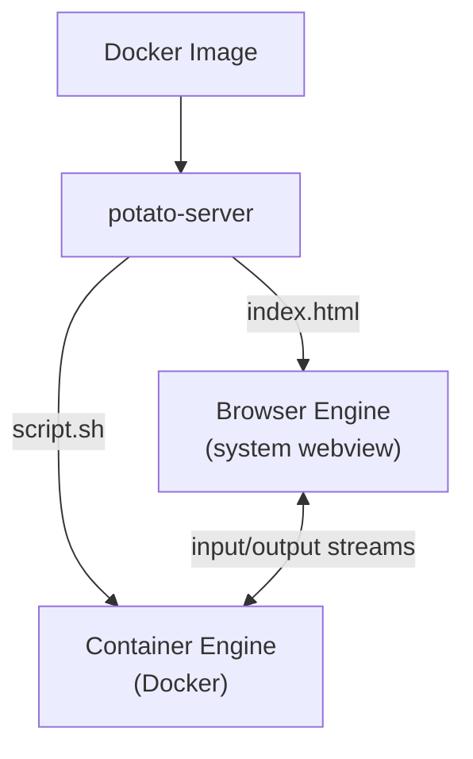

# Potato

A platform for building tiny minimalistic desktop apps that can be easily
distributed as OCI/Docker images. (For now Linux only)

Potato fully takes care of the distribution of desktop apps and removes the need
to set up a build system such as Tauri or Electron. Also removes the need to bundle
a browser engine with your app.

Potato apps run fully containerized: their "backends" is a small "serverless" CLI apps,
running inside a Docker or Podman container. The frontend runs inside your operating
systems built-in browser engine.

Since potato app's backends are just CLI apps, potato apps can still be used in
Unix pipelines.

Think: shell scripting, but with a desktop GUI and easier to share with others!


## How It Works

A Potato app is a Docker image containing:

1. **A fully static web frontend** (HTML/JS/CSS)
2. **"Backend" scripts or binaries** that run inside the container

Potato takes care of wiring the backend and frontend together and running your app:
the frontend can communicate with the backend using a streaming API - effectively,
stdin, stdout and stderr.




## The Streaming API

`POST /calls` creates a call and returns an SSE stream. The first event is `started` with a `call_id` that can be used to send stdin:

| Endpoint | Method | Description |
|---|---|---|
| `/calls` | POST | Create a call and stream output. Body: `{"cmd": ["/script.sh"]}`. Returns SSE stream. |
| `/calls/{id}/stdin` | POST | Send input to a running process. Body: `{"data": {...}}`. |

The server also exposes a management API on `/tmp/potato.sock`:

| Endpoint | Method | Description |
|---|---|---|
| `/activate` | POST | Activate an app. Body: `{"image": "app-name"}`. Extracts image and starts container. |
| `/apps` | GET | List active apps. |

### Event types

Backend processes can control event types by writing tagged JSON to stdout:

```sh
# Auto-tagged as {"event": "output", "data": "hello"}
echo "hello"

# Custom event type — passed through as-is
echo '{"event": "progress", "data": {"percent": 50}}'
```

Stderr output is automatically tagged as `{"event": "error", ...}`. When the process exits, an `{"event": "end"}` is sent.

## CLI Composability

Potato apps work like Unix tools:

```sh
# Pipe between apps
potato data-loader /export.sh | potato visualizer /plot.sh
```

## License

TBD
